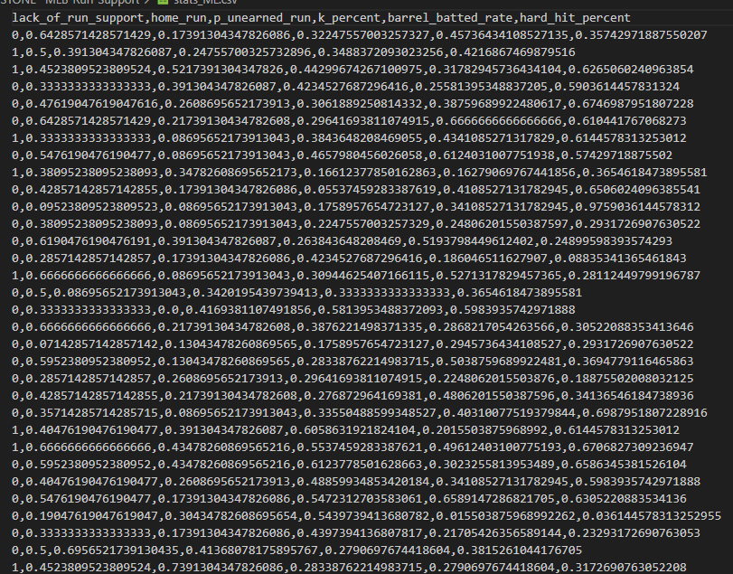
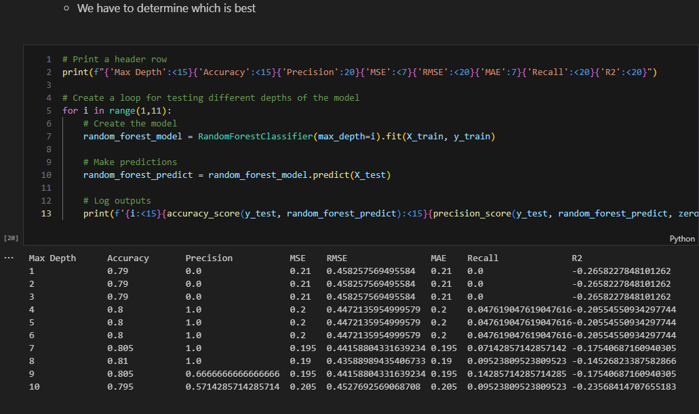

# MS-CAPSTONE--MLB-Run-Support
Identify pitching factors that lead to a lack of offensive run support.

### Author: Solomon Stevens
### Date: August 4th, 2024

## Description
Project to determine which statistics for MLB pitchers most likely lead to that pitcher's offense providing minimal run support.

## Report Links
* [Full Report](https://www.overleaf.com/read/gcjqhngmrbzc#562953)
* [Github Repository](https://github.com/Stone-Snevets/MS-CAPSTONE--MLB-Run-Support)

### Data Acquisition
The data taken for this project originates from [Baseball Savant](https://baseballsavant.mlb.com/).  They offer tons of statistical data for Major League Baseball.  The data can be sorted to the degree of liking by the user and can then be downloaded into a CSV file.

### Data Cleaning
Although the data from Baseball Savant is well kept, it isn't completely clean.  There were columns that needed to be dropped (such as a player ID number).  There were also columns that needed to be created.  The main column that required generating was the output column which indicates if a pitcher may have fallen prey to a lack of run support.  Once that was created, any columns with virtually no correlation to this new column were dropped as well.

### Data Exploration
Through the use of multiple graphs and maps, the data set was whittled down even further.  Multiple remaining columns showed irrelovant statistics and were thus removed.  Histograms showed which columns contained normal distributions of data, boxplots revealed outliers, and heat maps uncovered multicolinearity.

### Machine Learning
The factors left were then used to design and test multiple machine learning algorithms.  After testing, the winning model displayed a near 81 percent accuracy in predicting whether or not a pitcher is receiving ample run support.  Combning that with the correlations of each input variable with the output factor reveals which pitching statistic leads to the highest chance of losing support from one's offense.

## Results

It makes sense that allowing home runs contributes to lesser run support because a pitcher instantly lets up runs upon allowing a home run.  However, the correlation is negative which indicates that more home runs allowed lead to a better offensive support.  This is the complete opposite of what one would assume.  Letting up fewer home runs is better for pitching, but letting up more home runs means a pitcher's offense will support him more.

## Resources Used
* Python
  * Pandas
  * Pyplot
  * Seaborn
  * Sk-Learn
* Tableau

## Features
* Data Cleaning:
  * Combining Multipe Factors
  * Lambda Functions
  * Loc and Iloc
  * Pandas Dataframe Commands
  * Bar Graphs
* EDA:
  * Box Plots
  * Histograms
  * Pivot Tables
  * Seaborn Correlation Matrices
* Machine Learning:
  * Decision Trees
  * Determining Accuracy, Precision, MSE, RMSE, MAE, R2, Recall of a model
  * K-Nearest Neighbor
  * Logistic Regression
  * Naive Bayes Theorum
  * Normalizing Data
  * Random Forests
  * Train / Test Data Splitting

## Links used for coding
* https://datagy.io/pandas-conditional-column/
* https://www.statology.org/what-is-a-strong-correlation/
* https://www.geeksforgeeks.org/plotting-multiple-bar-charts-using-matplotlib-in-python/#
* https://matplotlib.org/stable/api/_as_gen/matplotlib.pyplot.bar.html

## Virtual Environment
To better run this project, one may set up a virtual environment on their computer.
* Create
1. Open a command prompt (cmd, conda, etc.)
1. Change your directory to your desired folder
1. Type the following into the command prompt:
> python -m venv name_of_your_virtual_environment
** A popular name of a virtual environment is simply `venv`

* Activate / Deactivate
Now that your virtual environment is created, we can activate and deactivate it at will.
1. Type the following command to activate your virtual environment:
** Windows:
> name_of_your_virtual_environment\Scripts\activate
** Mac / Linux
> $ source myvenv/bin/activate
1. After a second or two, your virtual environment is now alive!.
1. To deactivate it, simply type `deactivate` as a command in the command prompt

* Install Packages
Using `pip`, we can easliy install packages onto our virtual environment.
1. If you know what the name of the package is, simply type the following onto an activated virtual environment:
> pip install name_of_package

* For more understanding, feel free to check out these articles:
https://python.land/virtual-environments/virtualenv#How_to_create_a_Python_venv
https://python.land/virtual-environments/installing-packages-with-pip

## References
1. Bradbury, J.C.: Does the baseball labor market properly value pitchers? (2007)
2. Gitter, S.R., Rhoads, T.A.: If you win they will come: fans care about winning in
minor league baseball (2010)
3. Goold, K.L., Aniga, R.N., Gray, P.B.: Sports under quarantine: A case study of
major league baseball in 2020 (2020)
4. McElroy, L.: Computer vision in baseball: The evolution of statcast

## Screenshots

